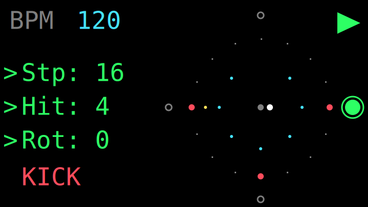
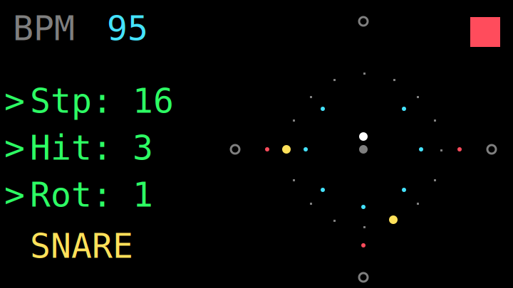
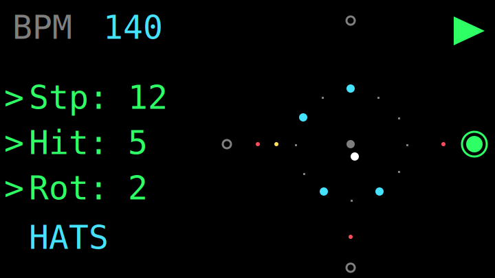
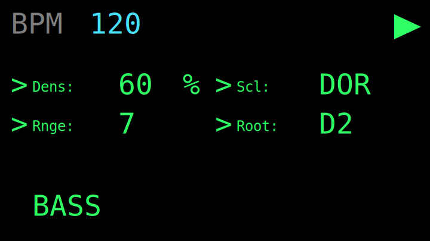

# BeatCYDa Desktop Sim

Simulador desktop do projeto BeatCYDa (anteriormente Penosa) para PC, feito em HTML/CSS/JavaScript puro, sem frameworks.

O BeatCYDa é uma máquina de grooves euclidiana com foco em performance e geração procedural de ritmos e linhas de baixo.

## Previews da Interface no Display (TFT)

Aqui estão representações fiéis (SVGs) da visualização gerada no display do BeatCYDa em diferentes circunstâncias de uso:

### 1. Tocando, Kick Selecionado


### 2. Parado, Snare Selecionada (Editando Hits e Rotação)


### 3. Tocando, Hats com ritmo complexo


### 4. Visão de Baixo (BassGroove)


## O que ele replica do hardware

- **Algoritmo Euclidiano:** Mesma lógica de `steps`, `hits`, `rotation` e `auto-rotate downbeat`.
- **Visualização:** Anéis concêntricos euclidianos (estilo display TFT) desenhados no `<canvas>`.
- **BassGroove:** Geração procedural de baixo estrutural baseada no bumbo, com controles de `density`, `bassProb` (probabilidade de tocar), `range`, `scale` e `root`.
- **Ghost Notes:** Controle de probabilidade global de notas fantasma (afeta SNARE, HATS, CRASH).
- **Slots:** Presets com persistência via `localStorage` (versão 2).
- **Audio WebAudio:** Sintese de alta fidelidade muito próxima às vozes do firmware original (`KickVoice`, `SnareVoice`, `HatsVoice`, `BassVoice`).
- **Offline Rendering:** Capacidade de exportar loops WAV e arquivos MIDI para DAWs.
- **Modo Lab:** Laboratório de algoritmo com seed determinística, step manual, export/import de estado JSON e log de debug.
- **Voice DSP:** Edição profunda de voz por track com controles de tune, decay, timbre, drive, snap, harmonics e modo de caixa (Snare, Rim, Clap).

## Como rodar localmente

Não é necessário build. O projeto é 100% Vanilla.

**Opção 1:**
Abra o arquivo `index.html` diretamente em seu navegador web (Google Chrome, Firefox, Safari, Edge).

**Opção 2 (Servidor local):**
```bash
python -m http.server 8080
```
Depois abra: [http://localhost:8080](http://localhost:8080) no seu navegador.

## Controles Globais (Navegador)

- `Space`: Play/Stop do transporte.
- `Seta Direita`: Avança um step manualmente quando o transporte estiver parado.
- `1..5`: Troca rápida de Track (Kick, Snare, Hats, Crash, Bass).

## Páginas da Interface Web

A navegação web simula os diferentes "modos" da máquina física:

1. **Perf (Performance):** Controles de transporte, BPM, e controles de macro como Auto Rot, Ghost Notes e Master Volume.
2. **Trk (Track):** Seleção de track, Mute e edição de ritmos euclidianos (Stp, Hit, Rot).
3. **Bass:** Controle do gerador de graves procedurais.
4. **Voice:** Edição avançada dos parâmetros do sintetizador para a track selecionada no momento.
5. **Slots:** Salvar e carregar snapshots rápidos.
6. **Lab:** Aba de experimentação. Exportação de áudio (WAV/MIDI), manipulação de Seed para aleatoriedade determinística, log do algoritmo e console de debug.

## UI Identity CYD

O código fonte utiliza `ui-tokens.js` como fonte única de verdade para a paleta de cores e identidade visual, de forma que o HTML (`styles.css`) e o `<canvas>` (`app.js`) permaneçam visualmente consistentes.

Abreviaturas curtas de três letras são o padrão oficial tanto no CSS quanto na renderização para otimizar espaço de tela.
